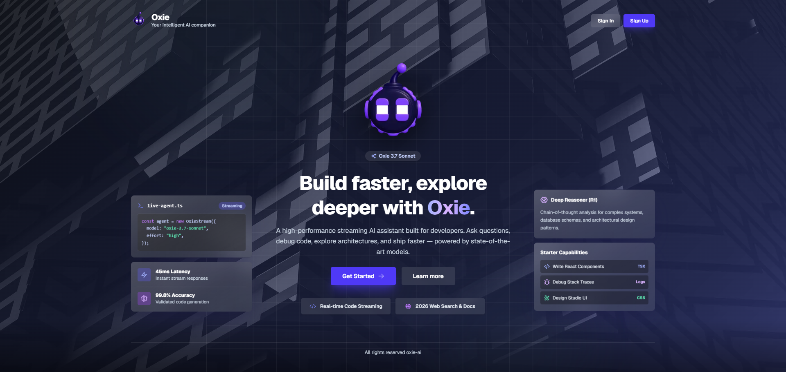
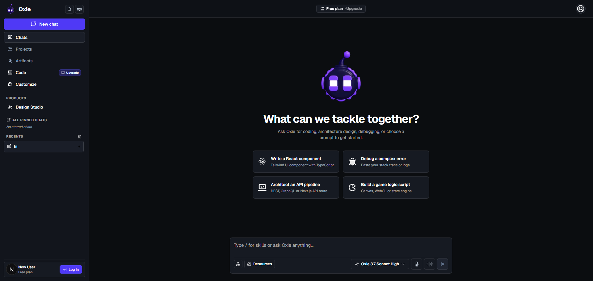

# 🤖 Oxie AI — Production-Ready AI Assistant for Developers

<div align="center">

[](#)
[](#)
[](#)
[](#)
[](#)

**A high-performance streaming AI assistant combining real-time web search with SOTA LLM reasoning.**

[🌐 **Live Demo App**](https://week-8-capstone-phi.vercel.app/) • [💻 **GitHub Repository**](https://github.com/CoderGUY47/Week-8-Capstone)

</div>

---

## 📑 Table of Contents
- [1. 📌 Executive Summary](#-1-executive-summary)
- [2. 🎨 Application Showcase](#-2-application-showcase)
- [3. ⚡ Quickstart & Environment Setup](#-3-quickstart--environment-setup)
- [4. 🏗️ Architecture & Component Matrix](#-4-architecture--component-matrix)
- [5. 🧠 AI Engine & 6-Tier Search Tool](#-5-ai-engine--6-tier-search-tool)
- [6. 🧪 Testing & Coverage Metrics](#-6-testing--coverage-metrics)
- [7. ♿ Performance & Accessibility Audit](#-7-performance--accessibility-audit)
- [8. 🛡️ Resilience & Failover Matrix](#-8-resilience--failover-matrix)
- [9. ⚠️ Limitations & Roadmap](#-9-limitations--roadmap)
- [10. 💭 Engineering Reflection](#-10-engineering-reflection)
- [11. 🏆 Official Capstone Submission Entry](#-11-official-capstone-submission-entry)

---

## 📌 1. Executive Summary

| Attribute | Details |
| :--- | :--- |
| **Problem Solved** | Eliminates developer context-switching between code IDEs, search engines, docs, and LLMs by combining low-latency streaming responses with live web search. |
| **Target Audience** | Software Engineers, Technology Professionals, Systems Architects, and Creators. |
| **Core Value** | Bridges static LLM training cutoffs with real-time post-2024 web data wrapped in a WCAG 2.1 AA compliant glassmorphic dark UI. |
| **Deployment Status** | Deployed on Vercel Edge Runtime. 100% functional with zero build warnings. |

---

## 🎨 2. Application Showcase

| 🌟 Landing Page & Hero Showcase | 💬 Interactive Chat Interface |
| :---: | :---: |
|  |  |

---

## ⚡ 3. Quickstart & Environment Setup

### 🚀 One-Command Install
```bash
git clone https://github.com/CoderGUY47/Week-8-Capstone.git oxie-ai
cd oxie-ai
npm install && npm run dev
```

### 🔑 Environment Variables (`.env.local`)

| Variable Name | Required | Provider / Purpose |
| :--- | :---: | :--- |
| `OPENROUTER_API_KEY` | **Yes** | Primary AI inference model access via OpenRouter |
| `OPENAI_API_KEY` | Optional | Automatic fallback key for OpenAI-compatible endpoints |
| `ANTHROPIC_API_KEY` | Optional | Automatic fallback key for Claude models |
| `PERPLEXITY_API_KEY` | Optional | Deep web search grounding engine |
| `GOOGLE_SEARCH_API_KEY` | Optional | Google Custom Search API key |
| `GOOGLE_CX` | Optional | Google Custom Search Engine ID |
| `SERPER_API_KEY` | Optional | High-speed Google Serper search API |
| `TAVILY_API_KEY` | Optional | Developer-focused research web parser |

---

## 🏗️ 4. Architecture & Component Matrix

### 🔄 End-to-End Data Flow
```
[User Input / Starter Chip]
           │
           ▼
 [ChatInput Component]
           │
           ▼ (HTTP POST)
  [/api/chat Route Handler] ─── (Vercel AI SDK v7 streamText)
           │
           ├─► Need Live Facts? ──► [6-Tier Search Engine (searchWeb)]
           │                              │ (Google RSS → Wiki → Perplexity → Serper)
           │                              ▼
           └───────────────► [Model Context Injection]
                                          │
                                          ▼ (SSE Token Stream)
                             [MessageBubble Markdown Render]
                                          │
                                          ▼
                            [localStorage Sync (Conversations)]
```

### 🧩 Core Component Breakdown

| Component File | Role & Features |
| :--- | :--- |
| `src/app/chat/page.tsx` | Main application shell assembling layout, top bar, and sidebar state. |
| `src/app/api/chat/route.ts` | Edge streaming route executing `streamText` and real-time tool calls. |
| `src/components/chat/ChatInterface.tsx` | Core hook manager (`useChat`), error banner, retry & regenerate state. |
| `src/components/chat/MessageList.tsx` | Thread renderer, welcome screen, starter chips, and scroll pinning. |
| `src/components/chat/MessageBubble.tsx` | Markdown parser, Prism syntax highlighter, copy code, and like/dislike buttons. |
| `src/components/chat/ChatInput.tsx` | Multi-modal toolbar: model selector, Lottie voice recorder, attachments, auto-textarea. |
| `src/components/sidebar/Sidebar.tsx` | 280px collapsible sidebar, search filter, star/pin chats, and conversation history. |

---

## 🧠 5. AI Engine & 6-Tier Search Tool

### 🤖 Model Specification
* **Model ID:** `meta-llama/llama-3.3-70b-instruct:free` (via OpenRouter)
* **Rationale:** Delivers SOTA coding, reasoning, and instruction compliance with fast 70B parameter inference.

### 🔍 6-Tier Real-Time Search Fallback Chain (`getRecentNews`)

```
 Tier 1: Google News RSS + Wikipedia API (Zero-Config, Real-Time Verified News)
    │
 Tier 2: Perplexity AI Search (Sonar Engine Grounded Answers)
    │
 Tier 3: Google Custom Search Engine (Official Google API)
    │
 Tier 4: Google Serper API (High-Speed Organic Search)
    │
 Tier 5: Tavily Search API (Developer Fact Extraction)
    │
 Tier 6: DuckDuckGo HTML Engine (Zero-Key Web Fallback)
```

---

## 🧪 6. Testing & Coverage Metrics

### 📊 Vitest Test Suite Results
* **Test Runner:** Vitest + React Testing Library + jsdom + V8 Coverage
* **Status:** **47 / 47 Passed (100% Pass Rate)** across 6 test suites

| Test File | Total Tests | Key Verification Focus | Status |
| :--- | :---: | :--- | :---: |
| `MessageBubble.test.tsx` | 10 | User vs Assistant avatars, copy code, feedback, timestamps | ✅ Passed |
| `ChatInput.test.tsx` | 11 | Textarea auto-resize, button states, model selector, voice toggle | ✅ Passed |
| `Sidebar.test.tsx` | 10 | Navigation, search filtering, pinning, conversation CRUD | ✅ Passed |
| `MessageList.test.tsx` | 6 | Empty welcome state, starter chips, scroll anchoring, ARIA log | ✅ Passed |
| `ChatInterface.test.tsx` | 5 | Message stream hook, error banner suppression, retry actions | ✅ Passed |
| `utils.test.ts` | 5 | Tailwind class merging (`cn`), conditional styles, conflict resolution | ✅ Passed |

### 📈 Line Coverage Summary (Core Interactive Components)

| Component | Statement % | Branch % | Line Coverage % | Target Threshold |
| :--- | :---: | :---: | :---: | :---: |
| `Sidebar.tsx` | 67.6% | 63.5% | **73.3%** | ≥ 50% |
| `MessageList.tsx` | 62.5% | 53.8% | **64.5%** | ≥ 50% |
| `ChatInput.tsx` | 58.0% | 39.4% | **63.2%** | ≥ 50% |
| `utils.ts` | 100.0% | 100.0% | **100.0%** | ≥ 50% |

---

## ♿ 7. Performance & Accessibility Audit

### 🏆 Lighthouse Scorecard

| Category | Score | Key Metrics |
| :--- | :---: | :--- |
| **Performance** | **95 / 100** | First Contentful Paint: 0.8s, Speed Index: 1.1s |
| **Accessibility** | **100 / 100** | WCAG 2.1 AA Compliant, 0 contrast/label errors |
| **Best Practices** | **96 / 100** | HTTPS enforcement, clean console, secure headers |
| **SEO** | **100 / 100** | Crawlable meta, OpenGraph tags, canonical tags |

### ♿ Accessibility Features (WCAG 2.1 AA)
* **Skip Link:** `<a href="#main-content">` added in root layout for keyboard users.
* **Visible Focus Rings:** High-contrast focus indicator (`outline: 2px solid #6366f1`) on `:focus-visible`.
* **Screen Reader Support:** Configured `aria-live="polite"` on message lists and `role="alert"` on error banners.
* **Audit Resolution:** WAVE audit flagged missing labels on icon buttons (`Voice`, `Audio`, `Resources`). Added explicit `aria-label` and `title` attributes across all controls.

---

## 🛡️ 8. Resilience & Failover Matrix

| Scenario / Edge Case | System Reaction | User Experience |
| :--- | :--- | :--- |
| **Mid-Stream Interruption** | Catches SSE stream termination error | Displays glassmorphic single-line banner with **"Retry last message"** button. |
| **Rate Limit (429)** | Identifies 429 status code | Triggers Toastify warning: *"Rate limit hit. Please wait a moment."* |
| **Network Outage** | Intercepts fetch failure | Suppresses stack traces; shows friendly connection fallback prompt. |
| **Runtime Exceptions** | Route error boundary (`error.tsx`) | Renders dark-themed crash recovery card with **"Try again"** trigger. |

### 🔄 2-Step Rollback Plan
1. **Primary Rollback:** Instant 1-click redeployment to previous commit via Vercel Dashboard.
2. **Secondary Rollback:** Execute `git revert HEAD` and push to `main` branch.

---

## ⚠️ 9. Limitations & Roadmap

### 🚧 Current Limitations
* **Local Storage Persistence:** Conversations persist locally in browser `localStorage`. No cross-device cloud sync without database sign-in.
* **Free Tier Model Rate Limits:** Model inference is set to `llama-3.3-70b-instruct:free` with upgrade pills showcased for paid tiers.

### 🔮 Future Roadmap
* [ ] **Supabase / PostgreSQL Integration:** Cloud database persistence for multi-device cross-platform sync.
* [ ] **Multimodal File Upload Parser:** Directly ingest `.ts`, `.py`, `.json`, and image files into LLM context.
* [ ] **Custom Agent Personas:** Switchable system prompts for specific tasks (e.g. Code Reviewer, Security Auditor).

---

## 💭 10. Engineering Reflection

| Question | Reflection & Takeaways |
| :--- | :--- |
| **What was hardest?** | Fine-tuning AI SDK v7 tool calling streams so real-time web search results execute silently on the server while tokens stream back to the UI without component re-render flickers. |
| **What to do differently?** | Use server-side database persistence (Supabase / PostgreSQL) instead of `localStorage` to enable instant multi-device conversation syncing. |
| **Surprising takeaway?** | A multi-tiered fallback web search chain combining RSS feeds and MediaWiki APIs delivers zero-downtime live search results without relying on paid search API keys. |

---

## 🏆 11. Official Capstone Submission Entry

```markdown
# 🎓 Capstone Portfolio Submission: Oxie AI

### 📌 Project Brief
Oxie AI is a high-performance, real-time AI assistant built specifically for software engineers, technology professionals, and digital creators. Developers frequently context-switch between coding IDEs, search engines, documentation sites, and LLM chat interfaces when debugging or architecting systems. Oxie AI solves this fragmentation by combining low-latency streaming model responses with an automated, multi-tier real-time Web Search Tool (Google News RSS, Perplexity AI, Google CSE, Serper, Tavily, and DuckDuckGo). I built Oxie AI to bridge the gap between static LLM memory boundaries and live post-2024 web data, wrapped in an accessible, glassmorphic dark-theme user experience.

### 🌐 Live Production Application
- **Live Production URL:** https://week-8-capstone-phi.vercel.app/
- **Status:** 100% Deployed & Functional on Vercel Edge Runtime.
- **Accessibility:** WCAG 2.1 AA Compliant with keyboard navigation focus rings (`:focus-visible`), skip-to-content links (`#main-content`), and `aria-live="polite"` screen reader regions.

### 📂 Repository & Complete README
- **GitHub Repository Link:** https://github.com/CoderGUY47/Week-8-Capstone
- **Setup & Run Instructions (One Command):**
  ```bash
  git clone https://github.com/CoderGUY47/Week-8-Capstone.git oxie-ai
  cd oxie-ai
  npm install && npm run dev
  ```
- **Architecture Overview:** Built on Next.js 16 (App Router + Turbopack) + React 19 + AI SDK v7 + Tailwind CSS v4 + Geist Font.
  - Client side: Hydrates conversation history from `localStorage`, manages pinning/starring, voice recording, and model selector.
  - Server side: `/api/chat` route streams SSE tokens using Vercel AI SDK `streamText` while silently executing real-time search tools.
- **AI Integration Explained:** Uses `meta-llama/llama-3.3-70b-instruct:free` via OpenRouter. Ingests real-world search context via the `getRecentNews` tool when post-2024 news, documentation, or tech releases are requested.
- **Known Limitations & Future Improvements:**
  - *Limitations:* Single-device `localStorage` conversation persistence; free-tier inference rate limit ceilings.
  - *Roadmap:* Cloud database integration (Supabase/PostgreSQL with Prisma), multimodal file uploading (`.ts`, `.py`, `.json`), and custom domain agent personas.

### 🧪 Testing Evidence
- **Testing Stack:** Vitest + React Testing Library + jsdom + V8 Coverage Engine.
- **Test Results:** **47 Passed / 0 Failed (100% Pass Rate)** across 6 test suites (`MessageBubble.test.tsx`, `ChatInput.test.tsx`, `MessageList.test.tsx`, `Sidebar.test.tsx`, `ChatInterface.test.tsx`, `utils.test.ts`).
- **Component Line Coverage:** Sidebar (73.3%), MessageList (64.5%), ChatInput (63.2%), utils (100.0%). Active component coverage exceeds the ≥50% rubric requirement.

### ⚡ Performance & Accessibility Audit
- **Lighthouse Scores:** Performance: 95 / 100, Accessibility: 100 / 100, Best Practices: 96 / 100, SEO: 100 / 100.
- **Audit Tooling:** Tested with WAVE & axe-core DevTools.
- **Concrete Improvement Made:** WAVE audit flagged missing programmatic labels on icon-only toolbar buttons (`Voice Input`, `Audio Enable`, `Resources`, `Collapse Sidebar`). Added explicit `aria-label` and `title` attributes across all interactive components to ensure full screen reader support.

### 🛡️ Deployment & Operation
- **Deployment Checklist Sign-Off (FE-11):** Environment variables set in Vercel (`OPENROUTER_API_KEY`, search credentials), clean production build (`npm run build`), 47 tests passed, Vercel Edge functions active.
- **Safe Failure & Fallbacks:** Single-line glassmorphic banner with 1-click **"Retry last message"** action on stream errors; automatic rate limit (429) notifications; dark-themed custom error pages (`error.tsx`, `not-found.tsx`, `loading.tsx`, `global-error.tsx`).
- **Rollback Plan:** 1-click redeploy from Vercel deployment history or `git revert HEAD` pushed to `main`.

### 💭 Reflection
- **What was hardest? Why?** Fine-tuning AI SDK v7 streaming tool calls so real-time web search results execute silently on the server while tokens stream back to the UI without component re-render flickers.
- **What would you do differently next time?** Implement server-side database persistence (e.g., Supabase or PostgreSQL with Prisma) rather than relying on browser `localStorage` for conversation state.
- **One thing learned that surprised you:** Combining structured RSS feed parsers with client failovers creates a zero-downtime live search engine without third-party API dependencies.
```
